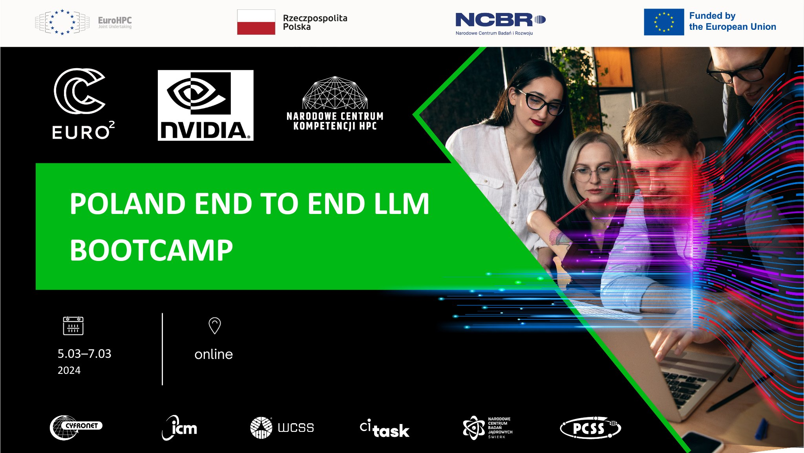

## Table of Contents
1. [Description](#description)
2. [Information](#information)
3. [Tools and Frameworks](#tools)
4. [Certificate](#certificate)
5. [Attribution](#attribution)
6. [Licensing](#licensing)

## Description

Together with NVIDIA and OpenACC organization, The Academic Computer Centre Cyfronet AGH, PLGrid Infrastructure, and Polish National Competence HPC Centre will host an online bootcamp starting March 5 and concluding March 7, 2024.

This bootcamp is designed to give NLP researchers an end-to-end overview of the fundamentals of the NVIDIA NeMo framework, a complete solution for building large language models. It will also have hands-on exercises complimented by tutorials, code snippets, and presentations to help researchers kick-start with NeMo LLM Service and Guardrails.

The End-to-End LLM (Large Language Model) Bootcamp is designed from a real-world perspective that follows the data processing, development, and deployment pipeline paradigm. Attendees walk through the workflow of preprocessing the SQuAD (Stanford Question Answering Dataset) dataset for Question Answering task, training the dataset using BERT (Bidirectional Encoder Representations from Transformers), and executing prompt learning strategy using NVIDIA® NeMo™ and a transformer-based language model, NVIDIA Megatron. Attendees will also learn to optimize an LLM using NVIDIA TensorRT™, an SDK for high-performance deep learning inference, guardrail prompts and responses from the LLM model using NeMo Guardrails, and deploy the AI pipeline using NVIDIA Triton™ Inference Server, an open-source software that standardizes AI model deployment and execution across every workload.

## Information

This content contains three Labs, plus an introductory notebook and two lab activities notebooks:

- Overview of End-To-End LLM bootcamp
- Lab 1: Megatron-GPT
- Lab 2: TensorRT-LLM and Triton Deployment with LLama-2-7B Model
- Lab 3: NeMo Guardrails  
- Lab Activity 1: Question Answering task 
- Lab Activity 2: P-tuning/Prompt tuning task

More information can be found on the [bootcamp website](https://www.openhackathons.org/s/siteevent/a0CUP000007wKsj2AE/se000330).

## Tools and Frameworks

The tools and frameworks used in the Bootcamp material are as follows:

- [NVIDIA NeMo™](https://www.nvidia.com/en-us/ai-data-science/generative-ai/nemo-framework/)
- [NVIDIA TensorRT™](https://developer.nvidia.com/tensorrt)
- [NVIDIA Triton™ Inference Server](https://www.nvidia.com/en-us/ai-data-science/products/triton-inference-server/)

## Certificate

The certificate for the workshop can be found below:

["Poland End-To-End LLM Bootcamp" - Academic Computer Centre Cyfronet AGH, PLGrid Infrastructure and Polish National Competence HPC Centre]() (Issued On: March 2024)

## Attribution

This material is an adaptation of the original repository from the [OpenHackathons Github](https://github.com/openhackathons-org/End-to-End-LLM).

## Licensing

Copyright © 2023 OpenACC-Standard.org. This material is released by OpenACC-Standard.org, in collaboration with NVIDIA Corporation, under the Creative Commons Attribution 4.0 International (CC BY 4.0). These materials may include references to hardware and software developed by other entities; all applicable licensing and copyrights apply.
